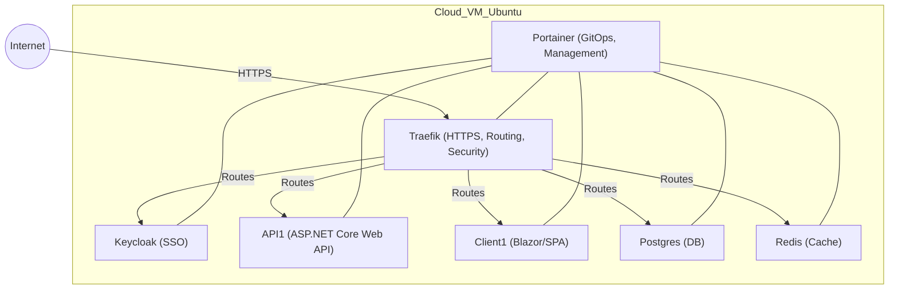

# Single-Node Production Infra for Startups

---

## Architecture Diagram

---

## Project Overview

This repository demonstrates how to deploy a modern, secure, and production-ready infrastructure for startups or small teams—without the complexity and cost of Kubernetes or multi-node clusters. The entire stack runs on a single Linux VM (e.g., on ArvanCloud), using Docker Compose, Traefik, and Portainer, with a focus on real-world business needs and operational simplicity.

### Why This Project?

Startups often don't need (or can't afford) the overhead of enterprise-grade, multi-node Kubernetes clusters. Instead, they need:

- Fast, reliable deployments
- Security and SSL by default
- Easy scaling (vertically, as needed)
- Minimal DevOps overhead
- Pay-as-you-go cloud costs

This project is a real-world, production-grade template for such scenarios, based on my experience helping a startup launch their MVP infrastructure.

## Key Features & Technical Highlights

- **Single-Node, Multi-Service Deployment:**

  - All services (APIs, UI clients, Keycloak, Postgres, Redis, etc.) run as Docker containers on a single VM.
  - Each service is isolated, easily managed, and can be updated independently.

- **Traefik Reverse Proxy:**

  - Automatic HTTPS with Let's Encrypt (auto-issuance and renewal)
  - Dynamic routing to Docker services via labels
  - Centralized entrypoint for all apps and APIs

- **Portainer for GitOps:**

  - GitOps-style deployment and management for Docker (like ArgoCD, but for Docker Compose)
  - Visual management of containers, stacks, and updates

- **Security by Design:**

  - TLS everywhere (terminated at Traefik)
  - CrowdSec for runtime protection against IP-based attacks
  - Network security delegated to cloud provider (firewall, WAF, DDoS)
  - Rate limiting and security headers via Traefik

- **SSO with Keycloak:**

  - Modern authentication using OpenID Connect and OAuth2
  - Centralized identity management for all apps

- **Database & Caching:**

  - Postgres for persistent storage (with external access via pgAdmin)
  - Redis for caching (with external access via Redis Insight)

- **CI/CD Ready:**

  - Each project is set up for streamlined CI/CD pipelines
  - Environment variables and secrets are managed for both local and production

- **Domain Management:**
  - Each service is exposed on its own (sub)domain, e.g.:
    - `client1.farshaddavoudi.ir`
    - `api1.farshaddavoudi.ir`
    - `sso.farshaddavoudi.ir`
    - `postgres.farshaddavoudi.ir`
    - `redis.farshaddavoudi.ir`

## Deep Dive: Technical Architecture

- **Docker Compose:**

  - Each service has its own `docker-compose.yml` for clarity and modularity.
  - Internal networking allows services to communicate securely.

- **Traefik Configuration:**

  - Uses file and Docker providers for dynamic routing
  - ACME integration for SSL
  - Rate limiting and security headers as middleware

- **Portainer:**

  - GitOps automation: deploys and updates stacks from GitHub
  - Visual dashboard for monitoring and troubleshooting

- **Environment Variables:**

  - All sensitive and environment-specific settings are injected via env vars
  - Supports seamless local development and production deployment

- **Scalability:**
  - Vertical scaling: simply resize the VM as needed
  - Easy to add new services or scale out with minimal changes

## Business Value

- **Cost-Effective:**
  - No need for expensive hardware or managed Kubernetes
  - Pay only for what you use (cloud VM, storage, bandwidth)
- **Fast Time-to-Market:**
  - Deploy new features and services in minutes
- **Security & Compliance:**
  - SSL, firewall, and runtime protection out of the box
- **Simplicity:**
  - Easy for small teams to understand, operate, and extend

## Getting Started

1. Clone this repository
2. Set up your cloud VM (Ubuntu recommended)
3. Run `setup-pwless-ssh.ps1` to configure passwordless SSH access:
   - This PowerShell script automates the process of setting up passwordless SSH authentication
   - Copies your Windows SSH public key to the Linux server's authorized_keys folder
   - Makes subsequent deployments and management much easier
4. Install Docker and Docker Compose
5. Configure your DNS records for each subdomain
6. Update environment variables and secrets as needed
7. Deploy with Docker Compose and manage with Portainer

## Who Should Use This?

- Startups and small teams launching MVPs or early-stage products
- Anyone who wants a production-grade, secure, and maintainable infra without Kubernetes
- DevOps engineers looking for a real-world, GitOps-based Docker stack

## License

MIT

---

If you have questions or want to discuss how this approach can help your startup, feel free to reach out or connect on LinkedIn.
